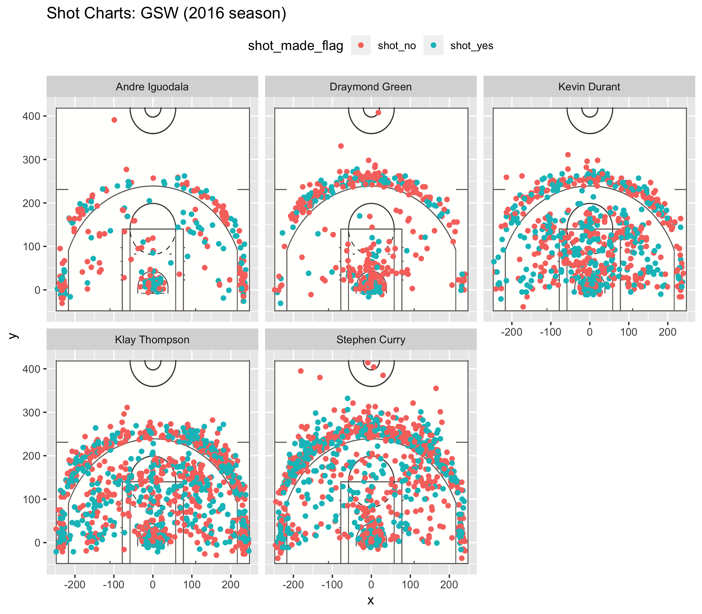

Golden State Warriors: An Analysis
================

Introduction
------------

The Golden State Warriors are the hottest NBA team in the nation right now. Their recent rise to fame over the past few years has brought them fame, glory, and unprecedented domination on the courts. What's powering this absolutely beast team, you may ask? Let's take a deep dive into the shooting performance of some of their key players: Andre Iguodala, Draymond Green, Kevin Durant, Klay Thompson, and Stephen Curry.

Analysis
--------

Here's a look at their shooting spreads and effective shooting percentages:

``` r

```


#### 2-Pointer Effective Shooting % by Player

``` r
knitr::kable(arrange(mutate(summarise(group_by(shots, name), total = sum(shot_type == "2PT Field Goal"), made = sum(shot_type == "2PT Field Goal" & shot_made_flag == "shot_yes")), perc_made = made / total), desc(perc_made)))
```

| name           |  total|  made|  perc\_made|
|:---------------|------:|-----:|-----------:|
| Andre Iguodala |    210|   134|   0.6380952|
| Kevin Durant   |    643|   390|   0.6065319|
| Stephen Curry  |    563|   304|   0.5399645|
| Klay Thompson  |    640|   329|   0.5140625|
| Draymond Green |    346|   171|   0.4942197|

#### 3-Pointer Effective Shooting % by Player

``` r
knitr::kable(arrange(mutate(summarise(group_by(shots, name), total = sum(shot_type == "3PT Field Goal"), made = sum(shot_type == "3PT Field Goal" & shot_made_flag == "shot_yes")), perc_made = made / total), desc(perc_made)))
```

| name           |  total|  made|  perc\_made|
|:---------------|------:|-----:|-----------:|
| Klay Thompson  |    580|   246|   0.4241379|
| Stephen Curry  |    687|   280|   0.4075691|
| Kevin Durant   |    272|   105|   0.3860294|
| Andre Iguodala |    161|    58|   0.3602484|
| Draymond Green |    232|    74|   0.3189655|

#### Overall Effective Shooting % by Player

``` r
knitr::kable(arrange(mutate(summarise(group_by(shots, name), total = n() , made = sum(shot_made_flag == "shot_yes")), perc_made = made / total), desc(perc_made)))
```

| name           |  total|  made|  perc\_made|
|:---------------|------:|-----:|-----------:|
| Kevin Durant   |    915|   495|   0.5409836|
| Andre Iguodala |    371|   192|   0.5175202|
| Klay Thompson  |   1220|   575|   0.4713115|
| Stephen Curry  |   1250|   584|   0.4672000|
| Draymond Green |    578|   245|   0.4238754|

### Interpretation

These tables and visualizations reveal a few interesting facts about the Golden State Warriors. The top scorers in the 2016 season, Klay Thompson and Steph Curry, had some of the lowest overall effective shooting percentages out of the five players. However, They were the most accurate 3-point shooters of the bunch. Meanwhile, Kevin Durant and Andre Iguodala, who had the highest overall effective shooting percentages, were also the most accurate 2-point shooters. Therefore, it seems like these players specialize in either 2-point shots or 3-point shots, but not both. Draymond Green has the effective lowest shooting percentage in all categories, and is the second lowest scorer. I guess he just sucks!
